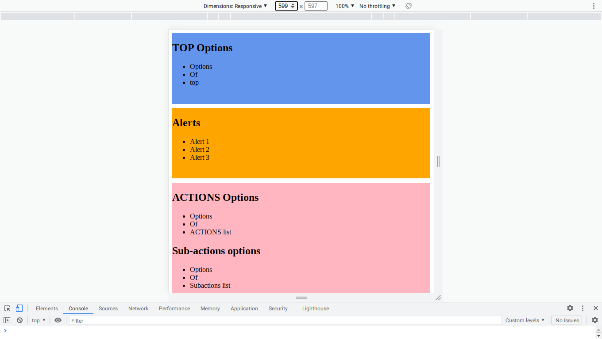

# Grid Responsive Practice

Practice some responsive concepts and Grid layout with CSS. Using the properties:

* grid-template-columns
* grid-template-rows
* grid-template-areas
* grid-area

## Screenshots

### Fullscreen layout

### Layout for small screen (less than 600px wide).

